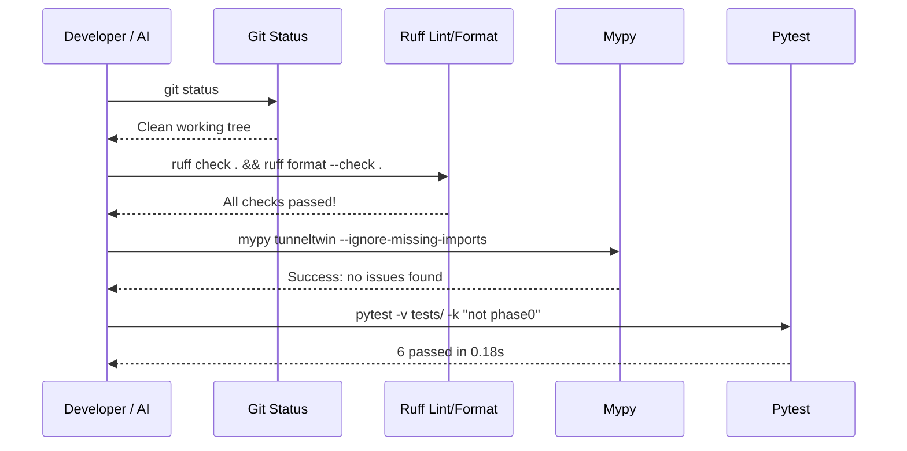

# TunnelTwin — Rollback Plan & Safety Net (ROLLBACK.md)

> **Core Philosophy**: A short, bulletproof plan for undoing a change if it breaks something — especially for large or risky edits.
>
> **WHY IT MATTERS**: Confidence to let AI make bigger changes comes from knowing exactly how to reverse them if they go wrong. If an AI session introduces regressions, breaks the lab testbed, or damages type integrity, do not attempt panicked blind edits. Stop, review this safety net, execute the targeted rollback recipe, and re-verify baseline green state.

---

## 1. Known Stable Checkpoints (Baseline Anchors)

Always know where safe harbor is before starting a risky refactor. These are the verified, passing commits on `main`:

| Commit SHA | Tag / Milestone | Status | Description |
|---|---|---|---|
| `c54dbf6` | **HEAD / Baseline** | **VERIFIED GREEN** | `fix(ci): resolve ruff lint/format violations and harden mypy step` (All 6 unit tests pass, ruff clean, mypy clean) |
| `7fa354f` | Checkpoint 2 | Passed | `ci: add CI/CD pipeline with lint, type-check, test, security, and release workflows` |
| `fccc27a` | Phase 0 Baseline | Passed | `feat(phase-0): initial scaffold, core models, netns testbed, and documentation` (4/4 profiles established) |
| `87e8635` | Initial Scaffolding | Passed | Initial repository commit |

---

## 2. Fast Rollback Triage Matrix

Find your scenario below and execute the corresponding recipe in [Section 3](#3-step-by-step-rollback-recipes):

| Scenario | Symptom / Situation | Target Action | Recipe |
|---|---|---|---|
| **Uncommitted Working Edits** | AI made edits to working tree; tests or linting broke; uncommitted | Discard all local working changes | [Recipe 1](#recipe-1-discard-all-uncommitted-working-tree-changes) |
| **Accidental Staging** | Files were staged with `git add` but should not be committed | Unstage files safely without losing work | [Recipe 2](#recipe-2-unstage-files-without-losing-work) |
| **Selective File Broken** | One or two files were corrupted or mistakenly modified | Restore only those specific files from HEAD | [Recipe 3](#recipe-3-restore-specific-files-or-directories) |
| **Bad Local Commit (Unpushed)** | Commit made locally that broke tests; need to rework it | Undo commit but keep modified code in editor | [Recipe 4](#recipe-4-undo-last-local-commit-keep-code-in-working-tree) |
| **Catastrophic Local Commit** | Bad commit made locally; changes are totally broken; discard completely | Hard reset working tree to previous commit | [Recipe 5](#recipe-5-hard-reset-to-previous-commit-or-known-good-sha) |
| **Bad Commit Already Pushed** | Bad commit was pushed to `origin/main` | Revert commit non-destructively via new revert commit | [Recipe 6](#recipe-6-revert-a-commit-already-pushed-to-remote) |
| **Lab Network State Corrupted** | `ip netns` namespaces locked, `charon.pid` collision, socket in use | Full kernel & daemon reset in WSL2/Linux | [Recipe 7](#recipe-7-reset-lab-testbed--linux-network-namespaces) |
| **Accidental Rollback Disaster** | Ran `git reset --hard` by accident; need lost work back | Recover lost commit via reflog | [Recipe 8](#recipe-8-emergency-recovery-via-git-reflog) |

---

## 3. Step-by-Step Rollback Recipes

### Recipe 1: Discard All Uncommitted Working Tree Changes

Use when an AI agent's edits broke the build and you want to completely revert back to the last clean commit state.

```bash
# 1. Discard all modifications to tracked files
git restore .

# 2. Remove any newly created untracked scratch files/directories
git clean -fd

# 3. Verify working tree is clean
git status
```
*Expected Output*: `nothing to commit, working tree clean`

---

### Recipe 2: Unstage Files Without Losing Work

Use when files were staged (`git add .`), but you need to selectively inspect or modify before committing.

```bash
# Unstage everything from git index (leaves your files untouched on disk)
git restore --staged .
```

---

### Recipe 3: Restore Specific Files or Directories

Use when you only want to revert specific broken files back to `HEAD` without touching other valid progress:

```bash
# Restore specific file
git restore tunneltwin/core/models.py

# Or restore an entire directory
git restore tunneltwin/rules/

# Or restore from a specific known good commit SHA (e.g. c54dbf6)
git checkout c54dbf6 -- tunneltwin/core/models.py
```

---

### Recipe 4: Undo Last Local Commit (Keep Code in Working Tree)

Use when you committed, but realized a test failed or something was missed. This uncommits but keeps all your edits in your editor so you can fix them.

```bash
git reset --soft HEAD~1
```
*All changes from the last commit will now appear as staged changes ready for adjustment.*

---

### Recipe 5: Hard Reset to Previous Commit or Known-Good SHA

Use when a commit is completely broken and must be discarded entirely.

```bash
# Hard reset back 1 commit:
git reset --hard HEAD~1

# OR hard reset directly to verified baseline commit (c54dbf6):
git reset --hard c54dbf6

# Clear any untracked leftovers:
git clean -fd
```

---

### Recipe 6: Revert a Commit Already Pushed to Remote

Use when a broken commit was already pushed to GitHub / remote origin. Never use force-push on shared main; create a revert commit instead.

```bash
# 1. Create a revert commit for the target bad commit
git revert <BAD_COMMIT_SHA> --no-edit

# 2. Run verification suite immediately
ruff check . && pytest -v tests/ -k "not phase0"

# 3. Push the clean revert
git push origin main
```

---

### Recipe 7: Reset Lab Testbed & Linux Network Namespaces

Use when the lab testbed (`ns-left`, `ns-right`) is in a hung, wedged, or failed state (e.g. after a killed script, unclosed socket, or `/var/run/charon.pid` lock).
*Must be executed inside WSL2 / Linux as root*:

```bash
# 1. Stop all charon daemons and kill stray processes
sudo bash lab/stop_charon.sh
sudo pkill -9 charon || true

# 2. Clean temporary sockets and logs
sudo rm -rf /tmp/tunneltwin

# 3. Teardown network namespaces and veth pairs
sudo bash lab/teardown_namespaces.sh

# 4. Flush any residual kernel XFRM states/policies on host
sudo ip xfrm state flush || true
sudo ip xfrm policy flush || true

# 5. Re-initialize fresh testbed
sudo bash lab/setup_namespaces.sh

# 6. Verify testbed is back to green
sudo bash lab/run_matrix.sh
```

---

### Recipe 8: Emergency Recovery via Git Reflog

Use if you ran `git reset --hard` by mistake and thought you lost work. Git keeps a local journal of all HEAD movements for 30–90 days.

```bash
# 1. View recent git actions and commit references
git reflog -n 15

# Example output:
# c54dbf6 HEAD@{0}: reset: moving to HEAD~1
# a1b2c3d HEAD@{1}: commit: my lost work

# 2. Recover the lost commit into a new safety branch:
git checkout -b rescue-branch a1b2c3d
```

---

## 4. Post-Rollback Re-Verification Checklist

Immediately after executing any rollback recipe, you MUST run this sequence to guarantee the repository is verified green:



### The 4-Step Re-Verification Commands:
1. **Working Tree Cleanliness**:
   ```bash
   git status
   ```
   *Must show*: `nothing to commit, working tree clean`
2. **Lint & Formatting**:
   ```bash
   ruff check . && ruff format --check .
   ```
   *Must show*: `All checks passed!`
3. **Type Checking**:
   ```bash
   mypy tunneltwin --ignore-missing-imports
   ```
   *Must show*: `Success: no issues found in 13 source files`
4. **Unit Tests**:
   ```bash
   pytest -v tests/ -k "not phase0"
   ```
   *Must show*: `6 passed, 1 deselected in 0.18s` (0 failed)

---

## 5. Summary Rule for AI Collaboration

> If a series of attempted fixes exceeds **2 iterations** without resolving an issue, **STOP immediately**, consult this `ROLLBACK.md`, revert back to the last known stable commit (`c54dbf6`), and re-diagnose with fresh logs. Never compound errors on top of broken state.
