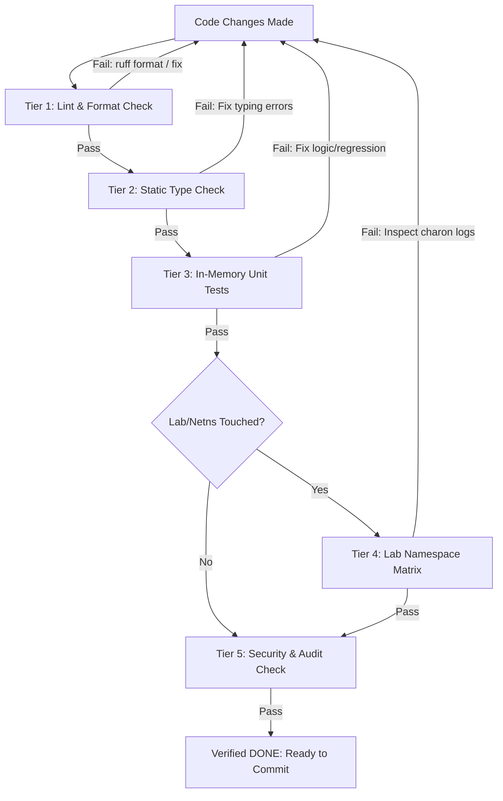

# TunnelTwin — Test Checklist & Verification Protocol (VERIFICATION.md)

> **Core Philosophy**: A concrete list of what to run and check before any change counts as "done."
> 
> **WHY IT MATTERS**: AI claiming success and code actually working are two completely different facts. This file is how you stop confusing them. Vibe checks, hypothetical assertions, and hand-wavy claims of correctness are strictly forbidden in TunnelTwin.

---

## 1. The "No Vibe Checks" Verification Protocol

Every code edit, refactoring, bug fix, or feature addition must complete the verification steps below before it can be marked as completed in `HANDOVER.md`, `FEATURE.md`, or git commits.



### The 4 Mandatory Rules of Verification
1. **Execute, Don't Assume**: Run the exact command in the active terminal shell. Never claim code works because "it should work."
2. **Inspect the Exit Code**: Verify exit code is `0`. Non-zero exit code is an immediate hard stop.
3. **Match Expected String Output**: Verify that the exact stdout/stderr match the expected output patterns listed in this document.
4. **Log the Proof**: When updating `FEATURE.md`, `BUG.md`, or session summaries, quote the real terminal output or test duration as empirical proof.

---

## 2. Tiered Verification Checklist

### Tier 1: Syntax, Linting & Formatting (Pre-Commit Gate)

Run these checks first. They execute in < 1 second and catch 80% of accidental syntax, unused imports, and style bugs.

#### 1.1 Ruff Linter
- **Command**:
  ```bash
  ruff check .
  ```
- **Expected Output**:
  ```text
  All checks passed!
  ```
- **Exit Code**: `0`
- **If It Fails**: Run `ruff check --fix .` for auto-fixable issues; manually resolve remaining violations according to `[tool.ruff.lint]` in [pyproject.toml](file:///c:/Users/piyus/OneDrive/Desktop/project/Shield/pyproject.toml#L43-L60).

#### 1.2 Ruff Formatter Check
- **Command**:
  ```bash
  ruff format --check .
  ```
- **Expected Output**:
  ```text
  22 files already formatted
  ```
  *(or `X files already formatted` with 0 files left to reformat)*
- **Exit Code**: `0`
- **If It Fails**: Run `ruff format .` to format all files to the project standard (120 char line length).

---

### Tier 2: Strict Static Type Checking

TunnelTwin enforces strict type annotations across all core data models, parsers, and probers.

- **Command**:
  ```bash
  mypy tunneltwin --ignore-missing-imports
  ```
- **Expected Output**:
  ```text
  Success: no issues found in 13 source files
  ```
  *(or `Success: no issues found in X source files`)*
- **Exit Code**: `0`
- **If It Fails**:
  - Check for missing type arguments (e.g. `ProvenancedFact[T]`).
  - Verify return types on all newly introduced helper functions.
  - Do NOT use `# type: ignore` unless working around third-party dynamic C-extensions (like raw Scapy fields).

---

### Tier 3: In-Memory Unit Test Suite

Fast unit tests that run in milliseconds on both Windows host and Linux/WSL2 environments without requiring root privileges.

- **Command**:
  ```bash
  pytest -v tests/ -k "not phase0"
  ```
  *(or specifically for provenance logic)*:
  ```bash
  pytest -v tests/test_provenance.py
  ```
- **Expected Output**:
  ```text
  ============================= test session starts =============================
  collected 7 items / 1 deselected / 6 selected

  tests/test_provenance.py::test_observed_fact PASSED                      [ 16%]
  tests/test_provenance.py::test_parsed_fact PASSED                        [ 33%]
  tests/test_provenance.py::test_inferred_fact_valid PASSED                [ 50%]
  tests/test_provenance.py::test_inferred_fact_invalid_confidence PASSED   [ 66%]
  tests/test_provenance.py::test_unknown_fact PASSED                       [ 83%]
  tests/test_provenance.py::test_normalized_connection_default_provenance PASSED [100%]

  ======================== 6 passed, 1 deselected in 0.18s =======================
  ```
- **Exit Code**: `0`
- **Zero-Failure Rule**: All tests must be green. If any test fails, do NOT commit or move on.

---

### Tier 4: Linux Network Namespace Integration Testbed (Lab Matrix)

Required whenever touching network namespaces, strongSwan configurations, IKE transforms, or lab runner automation.
*Environment Requirement*: Linux or WSL2 with `sudo` root privileges and `strongswan` / `swanctl` installed.

#### 4.1 Automated Matrix Runner Script
- **Command**:
  ```bash
  sudo bash lab/run_matrix.sh
  ```
  *(or Python wrapper: `sudo python3 lab/run_matrix.py`)*
- **Expected Terminal Output**:
  ```text
  ======================================================================
        TunnelTwin Phase 0: Testbed Matrix Automated Verification        
  ======================================================================

  [Step 1/3] Initializing network namespaces...
  [Step 2/3] Launching isolated charon instances...
  [Step 3/3] Executing Profile Verification Matrix...

  ----------------------------------------------------------------------
  Testing Profile [1/4]: weak
  ----------------------------------------------------------------------
  Loading weak config into ns-right (responder)...
  Loading weak config into ns-left (initiator)...
  Initiating connection 'weak-conn' (child 'weak-child') from ns-left...

  === ns-left swanctl --list-sas output ===
  weak-conn: #1, ESTABLISHED, IKEv1
    weak-child: #1, reqid 1, INSTALLED, TUNNEL, ESP:3DES_CBC/HMAC_SHA1_96

  === ns-right swanctl --list-sas output ===
  weak-conn: #1, ESTABLISHED, IKEv1
    weak-child: #1, reqid 1, INSTALLED, TUNNEL, ESP:3DES_CBC/HMAC_SHA1_96

  ✓ PROFILE 'weak' PASSED (ESTABLISHED on both ns-left & ns-right)

  ----------------------------------------------------------------------
  Testing Profile [2/4]: mixed
  ----------------------------------------------------------------------
  ...
  ✓ PROFILE 'mixed' PASSED (ESTABLISHED on both ns-left & ns-right)

  ----------------------------------------------------------------------
  Testing Profile [3/4]: strong
  ----------------------------------------------------------------------
  ...
  ✓ PROFILE 'strong' PASSED (ESTABLISHED on both ns-left & ns-right)

  ----------------------------------------------------------------------
  Testing Profile [4/4]: legacy-cbc
  ----------------------------------------------------------------------
  ...
  ✓ PROFILE 'legacy-cbc' PASSED (ESTABLISHED on both ns-left & ns-right)

  ======================================================================
                       PHASE 0 MATRIX SUMMARY REPORT                    
  ======================================================================
  Total Profiles Tested : 4
  Passed                : 4
  Failed                : 0

  ======================================================================
     PHASE 0 EXIT CRITERIA MET: 4/4 PROFILES VERIFIED ESTABLISHED!     
  ======================================================================
  ```
- **Exit Code**: `0`

#### 4.2 Pytest Integration Wrapper
- **Command**:
  ```bash
  pytest -v tests/test_phase0_matrix.py
  ```
- **Expected Output**:
  ```text
  tests/test_phase0_matrix.py::test_phase0_all_profiles_establish PASSED [100%]
  ============================== 1 passed in 12.52s ==============================
  ```
- **Exit Code**: `0`

---

### Tier 5: Security & Vulnerability Auditing

TunnelTwin is a security assessment tool and must adhere to the highest standard of internal security hygiene.

#### 5.1 Static Security Analysis (Bandit)
- **Command**:
  ```bash
  bandit -r tunneltwin/ -c pyproject.toml
  ```
- **Expected Output**:
  ```text
  [main] INFO profile include tests: None
  [main] INFO CLI args: -r tunneltwin/ -c pyproject.toml
  [main] INFO Files scanned: 13
  [main] INFO Lines of code: 850
  [main] INFO No issues identified.
  ```
- **Exit Code**: `0`

#### 5.2 Dependency Vulnerability Scan (pip-audit)
- **Command**:
  ```bash
  pip-audit --strict
  ```
- **Expected Output**:
  ```text
  No known vulnerabilities found
  ```
- **Exit Code**: `0`

---

### Tier 6: Package Build & Entrypoint Verification

Ensures packaging metadata, dependencies, and CLI entry points build and run cleanly.

#### 6.1 Package Build
- **Command**:
  ```bash
  python -m build
  ```
- **Expected Output**:
  ```text
  Successfully built tunneltwin-0.1.0.tar.gz and tunneltwin-0.1.0-py3-none-any.whl
  ```
- **Exit Code**: `0`

#### 6.2 CLI Entrypoint Smoke Check
- **Command**:
  ```bash
  python -c "import tunneltwin; print(tunneltwin.__version__)"
  ```
- **Expected Output**:
  ```text
  0.1.0
  ```
- **Exit Code**: `0`

---

## 3. Negative Invariants & Safety Constraints Checklist

Before any pull request or phase handover is certified, verify each negative constraint:

| Invariant | Verification Method | Pass Criteria |
|---|---|---|
| **1. Provenance Tag Completeness** | Code review & `test_provenance.py` | 100% of facts carry `OBSERVED`, `PARSED`, `INFERRED`, or `UNKNOWN`. Raw primitive untagged types forbidden. |
| **2. "Cannot Assess" on UNKNOWN** | Unit tests on rule evaluation | Any rule requiring an `unknown` parameter MUST evaluate to `"cannot assess"`, NEVER pass. |
| **3. Inferred Confidence Bounds** | `test_inferred_fact_invalid_confidence` | All `inferred` facts assert confidence $c \in [0.0, 1.0]$. Values outside raise `ValueError`. |
| **4. Safe Active Scanning Double-Gate** | Probe module unit tests | Prober fails immediately if IP not in Allowlist OR `consent_verified != True`. |
| **5. Cleanroom Originality** | Grep / Source review | Zero lines copied from external repos (CipherLens, IPsec Sentinel, etc.). |
| **6. No Lingering Processes** | `ps aux \| grep charon` in WSL2 | Lab teardown leaves zero zombie `charon` or `bash` background jobs. |

---

## 4. Phase Exit Gates Summary

| Phase | Core Objective | Concrete Exit Verification Command | Required Pass State |
|---|---|---|---|
| **Phase 0** | Testbed & Scaffolding | `sudo bash lab/run_matrix.sh` | `PHASE 0 EXIT CRITERIA MET: 4/4 PROFILES VERIFIED ESTABLISHED!` |
| **Phase 1** | Config Parsers | `pytest tests/test_parsers.py -v` | Cisco, strongSwan, FortiOS parsed into normalized schema with `parsed` tag |
| **Phase 2** | Active Prober | `pytest tests/test_prober.py -v` | Non-intrusive proposal probe response parsed into `observed` tags; consent denied stops execution |
| **Phase 3** | Compliance Engine | `pytest tests/test_rules.py -v` | NIST/ANSSI/RFC rules pass/fail/cannot-assess verified |
| **Phase 4** | Remediation Generator | `pytest tests/test_remediation.py -v` | Unified diffs generated and round-trip validated |
| **Phase 5** | PCAP Analyzer | `pytest tests/test_capture.py -v` | Live/file PCAP parsed; weak crypto & SPI mismatches flagged |
| **Phase 6** | ML Heuristics | `pytest tests/test_ml.py -v` | Confidence scores $\in [0.0, 1.0]$ with reasoning strings |
| **Phase 7** | Cryptographic Seal | `pytest tests/test_seal.py -v` | Merkle tree root hash reproducible; receipts verify |
| **Phase 8** | API, CLI & UI | `pytest tests/test_api.py -v` & UI smoke | API endpoints return 200; Web UI renders without console errors |
| **Phase 9** | E2E Demonstration | `pytest tests/ -v && sudo bash lab/run_matrix.sh` | 100% test pass rate across all modules |

---

## 5. One-Line Pre-Commit Verification Command

To run all local quality gates in a single copy-pasteable chain:

```bash
ruff check . && ruff format --check . && mypy tunneltwin --ignore-missing-imports && pytest -v tests/ -k "not phase0"
```

**If this one-liner passes with exit code 0, the change is verified and ready for commit.**
